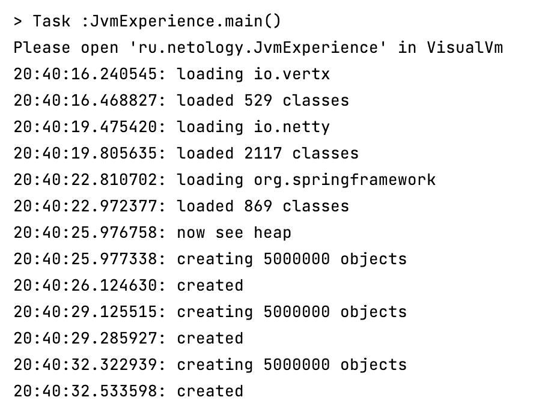
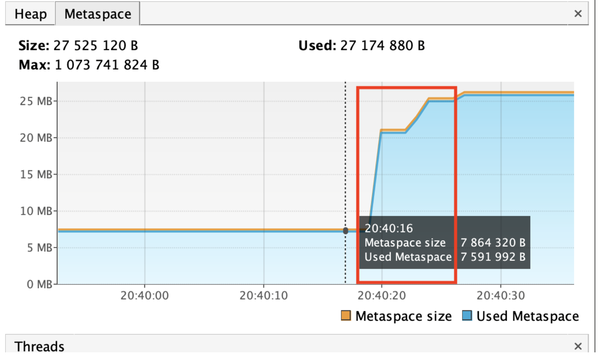
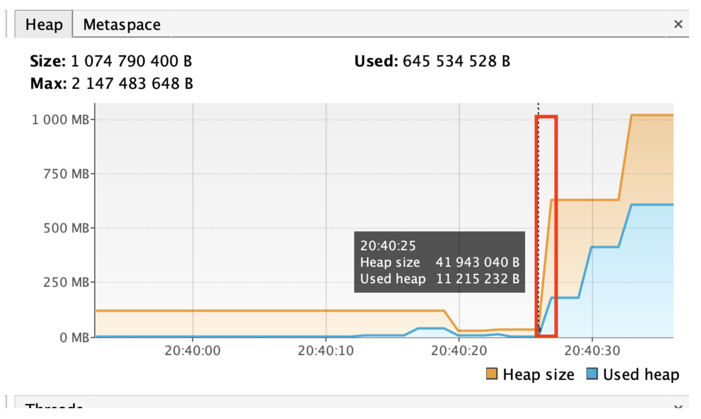
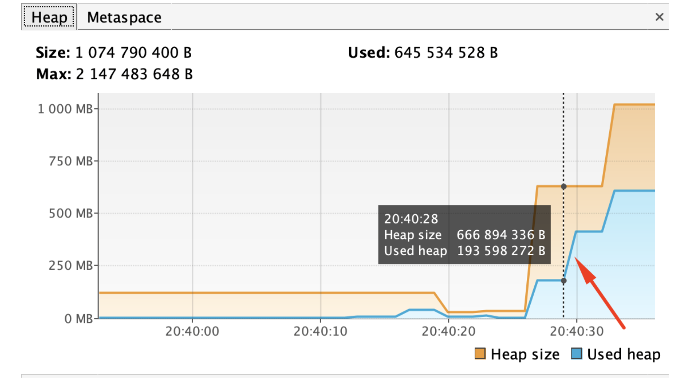
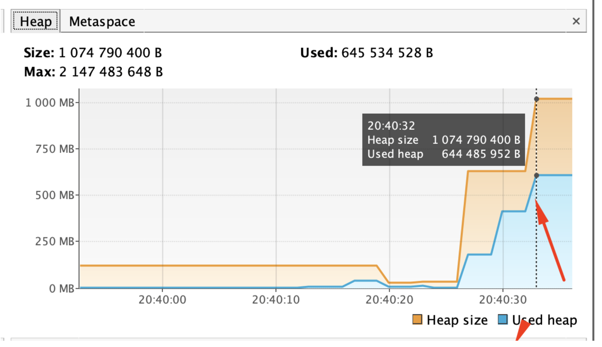

Вывод консоли:

1. Metaspace

- 20:40:16 - 20:40:23 - загрузка классов из пакетов io.vertex, io.netty, io.springframework
  

1. Heap

- 20:40:25 - 20:40:26 - создается 5_000_000 объектов в куче, увеличивается размер кучи:  
  List<SimpleObject> simpleObjects = createSimpleObjects(5_000_000);

- добавляется еще 5_000_000 объектов в куче:
  simpleObjects.addAll(createSimpleObjects(5_000_000));
  

- добавляется еще 5_000_000 объектов в куче, увеличивается размер кучи (резервируется дополнтительная память):  
  simpleObjects.addAll(createSimpleObjects(5_000_000));

